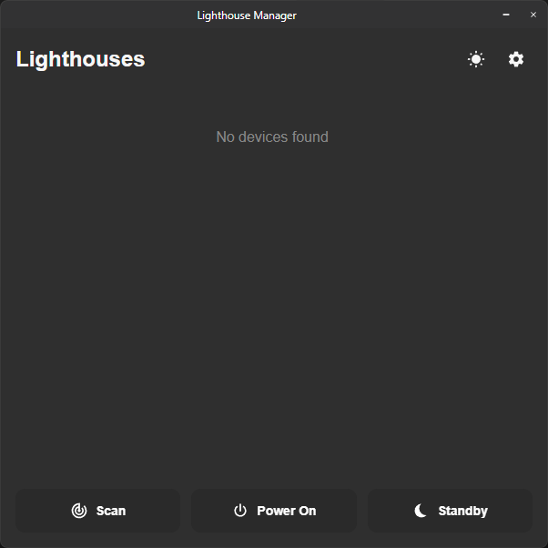

# Lighthouse Manager

## About

Lighthouse Manager is a tool for managing VR Lighthouse Base Stations via Bluetooth. It provides both a GUI application and a command-line interface (CLI).

## Installation

### Prerequisites

- Windows 10+
- Bluetooth adapter

### Steps

1. Download the latest release from the [Releases](https://github.com/matty/Lighthouse-rs/releases) page
2. Extract the zip file to your preferred location
3. Run `Lighthouse Manager.exe` for the GUI or `lighthouse-manager.exe` for the CLI

## Application

The application (`Lighthouse Manager.exe`) is a interface for managing your devices.

<p align="center">
	
</p>

### Features

- **Device Management**: Scan, view, and manage your Lighthouse devices.
- **Power**: Easily power on or put all devices into standby mode.
- **SteamVR Integration**: Automatically manage device power states based on SteamVR status.

## CLI Tool

The CLI tool (`lighthouse-manager.exe`) is designed for advanced users and automation scripts.

### Command Line Options

| Command     | Description                                         |
| :---------- | :-------------------------------------------------- |
| `--poweron` | Power on all detected Lighthouse devices            |
| `--standby` | Put all detected Lighthouse devices in standby mode |
| `--scan`    | Scan for devices                                    |
| `--devices` | Return a list of known devices                      |
| `--json`    | Output known devices in JSON format                 |
| `--help`    | Display help information                            |

### Examples

Power on all devices:

```powershell
.\lighthouse-manager.exe --poweron
```

Scan for new devices:

```powershell
.\lighthouse-manager.exe --scan
```

## SteamVR Integration (Beta)

Lighthouse Manager can integrate with SteamVR to automatically power on your Lighthouse devices when SteamVR starts and put them in standby mode when SteamVR exits.

| Command                | Description                                                             |
| :--------------------- | :---------------------------------------------------------------------- |
| `--register-steamvr`   | Register Lighthouse Manager with SteamVR for automatic power management |
| `--unregister-steamvr` | Unregister from SteamVR                                                 |
| `--steamvr-started`    | Called by SteamVR when it starts (powers on lighthouses)                |
| `--steamvr-stopped`    | Called by SteamVR when it exits (puts lighthouses in standby)           |

To set up SteamVR integration via CLI:

```powershell
.\lighthouse-manager.exe --register-steamvr
```

_Note: The GUI application also provides an interface for managing SteamVR integration._

## Building from Source

1. Ensure you have Rust, Cargo, and Node.js (with pnpm) installed.
2. Clone this repository.
3. Run the build script:

```powershell
.\build-release-win.ps1
```

This script will build both the GUI application and the CLI tool, placing the output in the `release` directory.

**Build Options:**

- `.\build-release-win.ps1 -AppOnly`: Build only the Tauri GUI application.
- `.\build-release-win.ps1 -CliOnly`: Build only the CLI tool.
- `.\build-release-win.ps1 -SkipInstall`: Skip installing frontend dependencies.

## License

This project is licensed under GNU GPLv3.

## Acknowledgements

- [btleplug](https://github.com/deviceplug/btleplug) library for Bluetooth functionality
- [Tauri](https://tauri.app/) for the GUI framework
